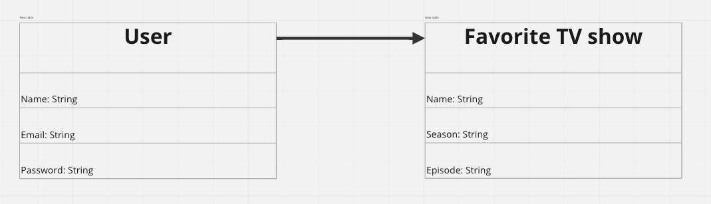
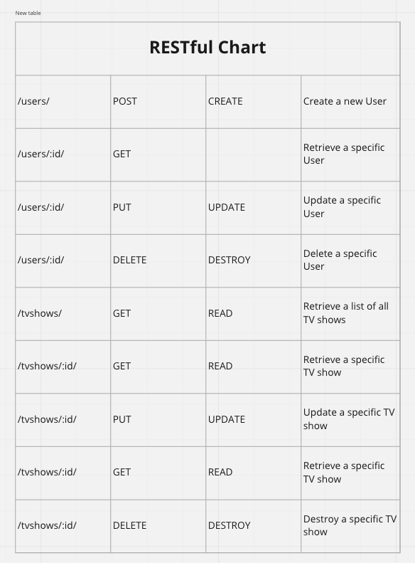
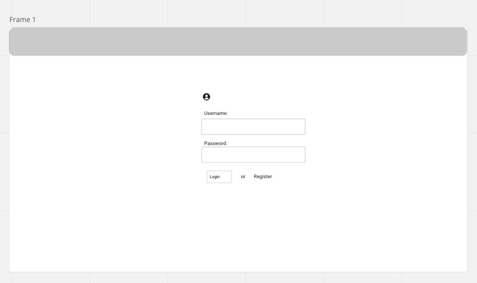
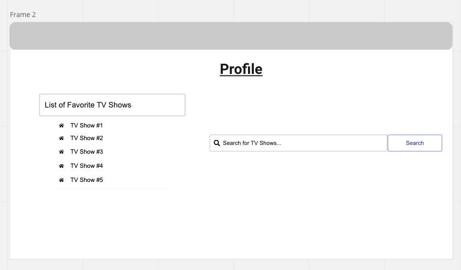

# BingeBuddy
Welcome to BingeBuddy, the app that lets you keep track of your favorite TV shows and manage your list with ease. Utilizing the TMDB API, this project allows you to add, view, update, and delete your favorite TV shows, giving you complete control over your list. Whether you're a TV buff or just looking for a convenient way to manage your watchlist, BingeBuddy is the perfect solution.

# To Visit
(enter website here)

# User Stories 
- As a User, I would like to have an account.
- As a User, I want to be able add a new TV show to my list, so that I can keep track of new shows that i want to watch
- As a User, I want to be able to edit a TV show on my list, so that I can update any incorrect information or change my opinion of a show 
- As a User, I want to be able to delete a TV show from my list, so that I can remove shows that I am no longer interested in
- As a User, I want to be able to search for a specific TV show on my list

# Installation Instructions 
- Create a directory for the project and move into that directory
- Python: Django is written in Python, so you'll need to have Python installed on your system. To check that python3 is installed and updated, in the command line type in: python3 --version
- Create a virtual environment by typing in the command line: python3 -m venv .env --(or whatever name you'd like to give it. Does not have to be '.env')
- Activate virtual environment, in the terminal type in the following: source .env/bin/activate
- You can install Django using pip, which is a package installer for Python. Open a command prompt or terminal and run the following command:  pip3 install django
- Make sure Django is installed by typing in the command line: pip3 list
- We will be using PostgresSQL as the database. In the terminal make sure to run: pip3 install psycopg2
- Now we'll save the installed packages as a list of dependencies in a text file, in the terminal type in: pip3 install -r requirements.txt
- Use the "django-admin" command to generate some of the project: django-admin startproject show_collector_project .  <--do not forget the period at the end
- Create a different app, this is where we will implement tha main functionality of collecting tv-shows and movies:  python3 manage.py startapp main_app
- Go to settings.py file and under 'INSTALLED_APPS' make sure to include the app: 'main_app',
- To run the Django development server use the following command: python manage.py runserver
- Visit localhost:8000 and you should see the Django rocket
- Enter the psql shell. In the command line enter: psql
- Create a sql database:  CREATE DATABASE bingebuddy
- Set the configuration in "settings.py" so the engine is postgresql and the name matches what's in DATABASES, type it under default as the following: 'NAME': 'bingebuddy',
- in that same location under 'ENGINE' instead of SQLite, make sure to change it to postgresql, that line should look like the following: 'ENGINE': 'django.db.backends.postgresql',
- next in the command line  type in: python3 manage.py migrate
- Run the server again to confirm the warning message is gone: python3 manage.py runserver

# Techstack
- Python
    - JavaScript
    - React
    - cors
    - axios
- Databasing
    - Posgres
- CSS
    - Bootstrap
- User Auth
    - Built in authentication
- DEVOPS
    - Heroku CLI

# ERD

# RESTful Routing

# Wireframing

# MVP Goals
### The MVP for BingeBuddy is: 
- Allow users to create accounts, and allow them to be personally customizable..
- Allow users to access a list of TV shows
- Allow users to add TV shows from list, as well as edit and delete shows from list

# Stretch Goals
- Allow for a user to have multiple lists to seperate genres
- Allow for a user to comment on certain movies 
- Allow for user to search and filter TV shows based on different criteria
- Allow for user to rate individual shows

# Approach Taken
* 

* 

# Unsolved Problems / Hurdles
*  

* 

* 